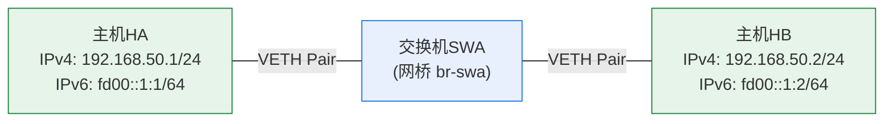

# 实验1：Linux虚拟网络环境初探

## 【实验目的】

本实验的核心目的是帮助实验者熟悉openEuler操作系统的基本操作，掌握Linux虚拟网络环境的核心原理，学会网络命名空间的创建、配置与管理技巧；掌握虚拟网络拓扑的构建方法，同时完成IPv4与IPv6双协议栈的配置、连通性测试及数据包抓取分析，为后续复杂网络实验奠定基础。

此外，实验涉及自动化脚本编写与AI工具辅助应用，旨在培养实验者的自动化操作能力与跨工具协作能力，提升实验效率与技术素养。

## 【实验内容】

手动创建实验1的网络拓扑，测试网络连通性并完成数据包抓取；尝试利用“网络拓扑助手”智能体辅助编写自动化脚本，并完成实验拓扑创建、网络连通性测试和数据包抓取。

## 【实验拓扑】

本实验需要构建包含两台主机和一台交换机的网络拓扑，两台主机通过交换机相连，并且均配置IPv4和IPv6双协议栈，如图1.1所示。主机HA的IPv4地址是192.168.50.1/24，IPv6地址是fd00::1:1/64；主机HB的IPv4地址是192.168.50.2/24，IPv6地址是fd00::1:2/64。

本实验网络拓扑中两台主机的IP地址可以调整，仅要求两个IP地址位于同一个子网内。

*图（mermaid 绘制，原图 images/计算机网络实验指导书2026版实验1_img1.png）：*


## 【实验步骤】

本节以openEuler 24.03-LTS版本为例，详细讲解虚拟网络拓扑搭建、IPv4/IPv6双协议配置、连通性测试、数据包抓取及自动化脚本实现的完整流程，实验者需按序完成每一步，确保操作无误后再进行下一步。

**步骤1：环境检查**

(1) 确保已切换至root用户：若未切换，可以打开终端，执行su - root，输入管理员密码完成权限切换。

(2) 确保软件工具已安装：执行ip -V、wireshark --version，确认iproute2与Wireshark安装正常。

**步骤2：创建虚拟网络拓扑**

创建三个网络命名空间，用于模拟两台主机和交换机；创建bridge和VETH接口，用于连接虚拟主机和交换机。

(1) 创建三个网络命名空间。

```bash
# 主机HA
ip netns add HA
# 主机HB
ip netns add HB
# 交换机SWA（网桥将运行于此命名空间）
ip netns add SWA
# 验证命名空间创建结果，应显示HA、HB、SWA
ip netns list
```

(2) 在SWA内创建bridge，启用bridge。

```bash
# 在SWA内部创建bridge
ip netns exec SWA ip link add br-swa type bridge
# 在SWA内部启用网桥bridge
ip netns exec SWA ip link set br-swa up
# 在SWA内验证bridge创建结果，应显示br-swa且状态为up
ip netns exec SWA ip link show
```

(3) 创建两对VETH对等接口，并迁移VETH接口至命名空间。

```bash
# 在主空间创建两对VETH接口
ip link add ve-ha-swa type veth peer name ve-swa-ha
ip link add ve-hb-swa type veth peer name ve-swa-hb
# 验证接口创建结果，应显示4个VETH接口，接口名以ve开头
ip link show
# 第一对VETH接口，迁移到HA和SWA
ip link set ve-ha-swa netns HA
ip link set ve-swa-ha netns SWA
# 第二对VETH接口，迁移到HB和SWA
ip link set ve-hb-swa netns HB
ip link set ve-swa-hb netns SWA
# 验证接口迁移结果（在各命名空间内，分别查看网络接口）
ip netns exec HA ip link show
ip netns exec HB ip link show
ip netns exec SWA ip link show
```

(4) 在SWA内，绑定交换机侧VETH接口至网桥，并启用交换机侧接口。

```bash
# 将交换机侧VETH绑定到网桥br-swa
ip netns exec SWA ip link set ve-swa-ha master br-swa
ip netns exec SWA ip link set ve-swa-hb master br-swa
# 启用交换机侧接口
ip netns exec SWA ip link set ve-swa-ha up
ip netns exec SWA ip link set ve-swa-hb up
# 验证网桥绑定状态，应显示交换机侧的两个VETH接口，且状态为up
ip netns exec SWA bridge link show br-swa
```

**步骤3：IPv4配置、连通性测试及数据包抓取**

为两台虚拟主机配置IPv4地址，验证两台虚拟主机的IPv4网络连通性，同时通过Wireshark捕获数据包，分析通信过程。

(1) 为两台虚拟主机配置IPv4地址，并启用主机接口。

```bash
# 在HA内，为ve-ha-swa接口配置IPv4地址：192.168.50.1/24
ip netns exec HA ip addr add 192.168.50.1/24 dev ve-ha-swa
# 在HB内，为ve-hb-swa接口配置IPv4地址：192.168.50.2/24
ip netns exec HB ip addr add 192.168.50.2/24 dev ve-hb-swa
# 启用HA和HB上的这两个接口
ip netns exec HA ip link set ve-ha-swa up
ip netns exec HB ip link set ve-hb-swa up
# 验证HA、HB的网络接口信息，应显示正确的IPv4地址，且状态为up
ip netns exec HA ip addr show ve-ha-swa
ip netns exec HB ip addr show ve-hb-swa
```

(2) 启动Wireshark抓包。

```bash
# 在HA命名空间内后台启动Wireshark
ip netns exec HA wireshark &amp;
```

在Wireshark界面中，选择ve-ha-swa接口，点击「开始捕获」按钮，抓取数据包。

(3) 执行IPv4连通性测试。

```bash
# 在HA内，ping HB的IPv4地址，发送2个数据包
ip netns exec HA ping -c 2 192.168.50.2
```

若终端输出“已发送 2 个包， 已接收 2 个包”，说明IPv4连通正常；否则，需检查接口状态或IP配置是否正确。

(4) 停止抓包并保存。

在Wireshark中点击「停止捕获」，将文件保存为pcap格式，后续可分析抓取的数据包。

**步骤4：IPv6配置、连通性测试及数据包抓取**

在现有实验拓扑基础上，为VETH接口配置IPv6地址，完成双协议栈部署并验证连通性，同时通过Wireshark捕获数据包，分析通信过程。

(1) 配置IPv6地址，选用唯一本地地址ULA（IPv6内网地址）。

```bash
# 在HA内，为ve-ha-swa接口配置IPv6地址：fd00::1:1/64
ip netns exec HA ip addr add fd00::1:1/64 dev ve-ha-swa
# 在HB内，为ve-hb-swa接口配置IPv6地址：fd00::1:2/64
ip netns exec HB ip addr add fd00::1:2/64 dev ve-hb-swa
# 验证IPv6配置，应显示正确的IPv6地址
ip netns exec HA ip -6 addr show ve-ha-swa
ip netns exec HB ip -6 addr show ve-hb-swa
```

(2) IPv6连通性测试。

```bash
# 在HA内，ping HB的IPv6地址，发送2个数据包
ip netns exec HA ping -c 2 fd00::1:2
```

若终端输出“已发送 2 个包， 已接收 2 个包”，说明IPv6连通正常；否则，需检查IPv6配置是否正确。

(3) IPv6数据包抓取。

与IPv4连通性测试实验的抓包过程一样，执行ping命令之前，后台启动Wireshark，选择ve-ha-swa接口，开始捕获。执行ping命令后，停止抓包并保存文件，可用于后续分析通信过程。

**步骤5：自动化脚本编写、部署与实验**

将手动操作命令整合为bash脚本，实现“一键创建虚拟网络拓扑”，可以提升实验效率，也可以支持多个网络实验复用相同的虚拟网络拓扑。

(1) 编写bash脚本。

编写bash脚本的方法有两种。其一是将“步骤2-步骤4”中使用的操作命令写入脚本文件，添加注释与执行逻辑，其二是借助“网络拓扑助手”智能体，辅助生成脚本文件。

以下是借助“网络拓扑助手”智能体，辅助生成脚本文件的提示词示例。**注意：**提示词中未明确说明IPv6地址，因此，本例中IPv6地址由智能体自主设计。

**提示词：**

```
帮我创建如下网络拓扑：一共有2台主机，主机HA的IP地址是192.168.50.1，主机HB的IP地址是192.168.50.2。这两台主机通过一台交换机连接在一起。然后再帮我为这两台主机分配并设置IPv6地址，构成双协议栈网络。
```

“网络拓扑助手”智能体会创建脚本，并给出使用方法。

(2) 按照“网络拓扑助手”智能体给出的说明，执行脚本并创建实验网络拓扑。

```bash
# 修改脚本权限后，在脚本保存目录内，执行脚本程序
./create_topology.sh create
```

(3) 验证实验网络拓扑和配置并记录。

```bash
# 验证命名空间
ip netns list
# 在各命名空间内，分别验证网络接口（使用上一步得到的命名空间名）
ip netns exec HA ip link show
ip netns exec HB ip link show
ip netns exec SWA ip link show
# 在交换机命名空间内，验证网桥接口绑定（使用上一步得到的网桥名）
ip netns exec SWA bridge link show br_SWA
# 在各主机命名空间内，验证IPv4地址和IPv6地址配置
ip netns exec HA ip addr
ip netns exec HB ip addr
```

若验证结果不满足实验拓扑，可以将验证和测试结果粘贴给“网络拓扑助手”智能体，请求智能体修改网络拓扑脚本。重新创建网络拓扑，验证通过后，再进行后续步骤。

记录你创建的实验拓扑中，主机和交换机的命名空间（NS）名称、NS内VETH接口名称、VETH接口的IP地址（若有）、VEYH接口的MAC地址、VETH接口的对端接口名称和所属NS名称。需记录的信息的位置如图1.2所示。

(4) IPv4和IPv6连通性测试和数据包抓取。

*图（log 绘制，原图 images/计算机网络实验指导书2026版实验1_img2.png）：*

```log
[root@bogon test-sh]# ip netns list
HA (id: 0)
HB (id: 2)
SWA (id: 1)
[root@bogon test-sh]# ip netns exec HA ip addr
1: lo: <LOOPBACK> mtu 65536 qdisc noop state DOWN group default qlen 1000
    link/loopback 00:00:00:00:00:00 brd 00:00:00:00:00:00
4: ve_HA_SWA@if3: <BROADCAST,MULTICAST,UP,LOWER_UP> mtu 1500 qdisc noqueue state UP group default qlen 1000
    link/ether 82:eb:13:d6:dd:6e brd ff:ff:ff:ff:ff:ff link-netns SWA
    inet 192.168.50.1/24 scope global ve_HA_SWA
       valid_lft forever preferred_lft forever
    inet6 fd00::1/64 scope global
       valid_lft forever preferred_lft forever
    inet6 fe80::80eb:13ff:fed6:dd6e/64 scope link proto kernel_ll
       valid_lft forever preferred_lft forever
```
```bash
# 在HA命名空间内后台启动Wireshark，然后在Wireshark界面中，启动抓包
ip netns exec HA wireshark &amp;
# 在HA内，ping HB的IPv4地址，发送2个数据包
ip netns exec HA ping -c 2 192.168.50.2
# 在HA内，ping HB的IPv6地址，发送2个数据包（使用上一步验证时得到的IPv6地址，以fd00::2为例）
ip netns exec HA ping -c 2 fd00::2
```

在Wireshark中点击「停止捕获」，将文件保存为pcap格式，后续可分析抓取的数据包。

**步骤6：数据包分析和实验报告撰写**

在Linux环境的Wireshark中或Windows环境的Wireshark中，分析抓取的数据包，并完成实验报告撰写。
