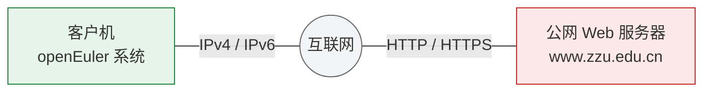

# 实验2：HTTP协议探索与分析

## 【实验目的】

本实验的核心目的是帮助实验者熟悉HTTP协议的请求与响应标准格式，掌握TLS加密流量解密方法；掌握Wireshark中抓包、流量过滤、TCP流追踪的方法，能够独立解析HTTP报文核心字段，并理解Cookie的工作机制。

此外，实验通过HTTP协议报文抓取、分析及验证，培养实验者的网络协议场景辨析能力与问题排查能力，夯实HTTP协议理论基础。

## 【实验内容】

基于openEuler 搭建实验环境，通过保存和配置TLS会话密钥日志实现HTTPS加密流量解密；在客户端访问Web服务器过程中，使用Wireshark抓取HTTP/HTTPS数据包；利用过滤器筛选目标流量，追踪HTTP流并解析HTTP请求与响应报文；进而分析Cookie字段的格式及作用；统计TCP会话并分析TCP并发连接数。

## 【实验拓扑】

本实验拓扑由openEuler客户主机、公网Web服务器（以郑州大学官网www.zzu.edu.cn为例）组成，客户机通过Vmware网络或直接接入互联网，能够访问公网Web服务器。实验拓扑如图2.1所示。

本实验拓扑支持两种通信场景：

*图（mermaid 绘制，原图 images/计算机网络实验指导书2026版实验2_img1.png）：*


（1）客户主机IPv4单栈场景：客户主机仅启用IPv4协议，全程通过IPv4协议与Web服务器建立HTTPS通信；

（2）客户主机IPv4/IPv6双栈场景：客户主机同时启用IPv4、IPv6双协议栈，由客户主机的操作系统和浏览器根据当前网络情况，自主决定采用IPv4协议或IPv6协议与Web服务器建立HTTPS通信。

本实验中，公网Web服务器可以使用其他支持cookie的Web服务器。

## 【实验步骤】

本节以openEuler 24.03-LTS版本为例，详细讲解TLS会话密钥日志保存与配置、IPv4/IPv6双场景抓包、流量过滤、报文分析、Cookie解析的完整流程，实验者需按序完成每一步，确保操作无误后再进行下一步。

**步骤1：环境检查**

(1) 确保已切换至root用户。若未切换，可以打开终端，执行su - root，输入管理员密码完成权限切换。

(2) 确保软件工具已安装。执行ip -V、wireshark --version，确认iproute2与Wireshark安装正常。

(3) 确保浏览器已安装，建议使用Firefox浏览器。

(4) 检查浏览器（以Firefox为例）访问www.zzu.edu.cn时，优先使用哪个版本的IP协议。打开Firefox浏览器，在地址栏输入`about:networking#dns`，打开“关于网络连接”页面如图2.2所示。

在域名框中输入`www.zzu.edu.cn`，点击「解析」按钮。若查询结果中IPv4地址在前，则访问www.zzu.edu.cn时，优先使用IPv4；若查询结果中IPv6地址在前，则访问www.zzu.edu.cn时，优先使用IPv6。

*图（text 绘制，原图 images/计算机网络实验指导书2026版实验2_img2.png）：*

```text
┌─ Firefox ─ 关于网络连接 ─────────────────────────────────────── ─ □ ✕ ─┐
│ [←] [→] [⟳] [ about:networking#dnslookuptool                ] [☆] [≡] │
├───────────────┬────────────────────────────────────────────────────────┤
│  HTTP         │   DNS 查询                                             │
│  套接字        │   ┌──────────────────────────────────┐ ┌──────┐        │
│  DNS          │   │ 域名: www.zzu.edu.cn             │ │ 查询 │        │
│  WebSocket    │   └──────────────────────────────────┘ └──────┘        │
│ ▶DNS 查询     │   ┌────────────────────────────────────────────────┐   │
│  日志          │   │ IP                                             │   │
│  HTTP 资源记录 │   │ 202.196.64.194                                 │   │
│  RCWN 统计     │   │ 202.196.64.48                                  │   │
│  网络 ID       │   │ 2001:da8:5000:6c00::48                         │   │
│               │   │ 2001:da8:5000:6c00::47                         │   │
│               │   └────────────────────────────────────────────────┘   │
└───────────────┴────────────────────────────────────────────────────────┘
```
**步骤2：保存并配置TLS密钥日志，实现HTTPS抓包**

HTTPS流量基于TLS加密，为读取明文信息，必须提前保存TLS会话密钥日志。在Wireshark抓取数据包后，再配置密钥日志文件，Wireshark才能实现密文解密，将明文信息展示给用户。

(1) 配置TLS会话密钥日志环境变量。

```bash
# 配置TLS会话密钥日志输出路径
export SSLKEYLOGFILE=~/myssl.log
```

环境变量SSLKEYLOGFILE指明了浏览器保存TLS会话密钥日志的位置，如本步设置的参数，TLS会话密钥日志将被保存在用户的主目录下，文件名为“myssl.log”。

采用export命令设置的环境变量，仅在当前终端会话内有效。

(2) 在同一个终端内，后台启动Firefox浏览器，等待进程就绪，Firefox浏览器会将TLS会话密钥日志保存在上一步配置的位置。

```bash
# 后台启动Firefox
firefox &amp;
```

(3) 启动Wireshark抓包。

```bash
# 后台启动Wireshark
wireshark &amp;
```

在Wireshark中，选择物理网络接口（虚拟机环境中通常是ens33，真机环境通常是eth0），点击「开始捕获」按钮，抓取数据包。

(4) 用Firefox浏览器访问Web服务器（https://www.zzu.edu.cn），等待网页完全显示出来。

(5) 停止Wireshark抓包，然后配置TLS会话密钥日志文件。

在Wireshark中，按如下步骤进行配置：

- 点击「停止捕获」按钮，停止抓包。
- 点击“编辑”菜单中的“首选项”，打开首选项配置窗口。
- 在首选项配置窗口中，点击左侧“Protocols”旁边的「▶」，然后在协议列表中找到TLS，如图2.3所示。
- 在右侧的配置窗口中，点击“(Pre)-Master-Secretlog filename”旁边的「浏览」按钮，选择自己保存的“myssl.log”文件，配置TLS会话密钥日志文件。
- 最后，点击「OK」按钮，使配置生效。

完成本步配置后，Wireshark会自动将TLS加密的数据解密，展示明文信息给用户。

**步骤3：过滤流量，追踪HTTP流，分析HTTP报文格式**

*图（text 绘制，原图 images/计算机网络实验指导书2026版实验2_img3.png）：*

```text
┌─ Wireshark · 首选项 ──────────────────────────────────────── ─ □ ✕ ─┐
│ ┌───────────────────┐   Protocols                                  │
│ │ Appearance        │   ☐ Display hidden protocol items            │
│ │ Columns           │   ☐ Display byte fields with a space         │
│ │ Font Styles       │       character between bytes                │
│ │ Capture           │   ☐ Look for incomplete dissectors           │
│ │ Filter Buttons    │   ☐ Enable stricter conversation tracking    │
│ ▶│ Protocols        │       heuristics                             │
│ │                   │   ☐ Ignore duplicate frames                  │
│ │  ┌───────────────┐ │   Deinterlacing conversations key            │
│ │  │ Protocol      │ │     [ NONE                     ▼ ]           │
│ │ ▶│ 29West        │ │   The max number of hashes to keep in        │
│ │  │ 2dparityfec   │ │   memory for determining duplicates frames   │
│ │  │ 3GPP2 A11     │ │     [ 10000 ]                                │
│ │  │ 6LoWPAN       │ │                                              │
│ │  │ 802.11 Radio  │ │                                              │
│ │  │ 802.11 Radiotap│ │                                             │
│ │  │ 9P            │ │                                              │
│ │  │ A-bis OML     │ │                                              │
│ │  │ A21           │ │                                              │
│ │  │ AC DR         │ │                                              │
│ │  │ ACAP          │ │                                              │
│ │  │ ACN           │ │                                              │
│ │  │ ACR 122       │ │                                              │
│ │  │ ACTrace       │ │                                              │
│ │  │ ADB           │ │                                              │
│ │  │ ADB CS        │ │                                              │
│ │  │ ADB Service   │ │                                              │
│ │  │ ADP           │ │                                              │
│ │  │ ADwin         │ │                                              │
│ │  │ Aeron         │ │                                              │
│ │  │ AFS (RX)      │ │                                              │
│ │  │ AgentX        │ │                                              │
│ │  │ AIM           │ │                                              │
│ │  │ AJP13         │ │                                              │
│ │  │ ALC           │ │                                              │
│ │  │ ALCAP         │ │                                              │
│ │  │ AllJoyn ARDP  │ │                                              │
│ │  └───────────────┘ │                                              │
│ └───────────────────┘          [ OK ] [ Cancel ] [ Apply ] [ Help ] │
└─────────────────────────────────────────────────────────────────────┘
```
*图（text 绘制，原图 images/计算机网络实验指导书2026版实验2_img4.png）：*

```text
┌─ Wireshark · 首选项 ──────────────────────────────────────── ─ □ ✕ ─┐
│ ┌───────────────────┐   Transport Layer Security                   │
│ │ Appearance        │   RSA keys list              [ Edit... ]    │
│ │ Columns           │   TLS debug file      [                    ]  │
│ │ Font Styles       │   ☑ Reassemble TLS records spanning          │
│ │ Capture           │       multiple TCP segments                  │
│ │ Filter Buttons    │   ☑ Reassemble TLS Application Data          │
│ ▶│ Protocols        │       spanning multiple TLS records          │
│ │                   │   ☐ Message Authentication Code (MAC),       │
│ │  ┌───────────────┐ │       ignore "mac failed"                    │
│ │  │ Teredo        │ │   Pre-Shared Key                             │
│ │  │ TETRA         │ │   (Pre)-Master-Secret log filename           │
│ │  │ TFP           │ │     [ /root/myssl.log ] [ 浏览... ]          │
│ │  │ TFTP          │ │                                              │
│ │  │ Thread        │ │                                              │
│ │  │ Thrift        │ │                                              │
│ │  │ Tibia         │ │                                              │
│ │  │ TIME          │ │                                              │
│ │  │ TIPC          │ │                                              │
│ │  │ TiVoConnect   │ │                                              │
│ │ ▶│ TLS           │ │                                              │
│ │  │ TNS           │ │                                              │
│ │  │ Token-Ring    │ │                                              │
│ │  │ TPCP          │ │                                              │
│ │  │ TPKT          │ │                                              │
│ │  │ TPLINK-SMART… │ │                                              │
│ │  │ TPM2.0        │ │                                              │
│ │  │ TPNCP         │ │                                              │
│ │  │ TRANSUM       │ │                                              │
│ │  │ TREL          │ │                                              │
│ │  │ TSDNS         │ │                                              │
│ │  │ TSP           │ │                                              │
│ │  │ TTE           │ │                                              │
│ │  │ TURNCHANNEL   │ │                                              │
│ │  │ TUXEDO        │ │                                              │
│ │  │ TZSP          │ │                                              │
│ │  │ UA3G          │ │                                              │
│ │  └───────────────┘ │                                              │
│ └───────────────────┘          [ OK ] [ Cancel ] [ Apply ] [ Help ] │
└─────────────────────────────────────────────────────────────────────┘
```
在Wireshark抓包时，由于没有配置捕获过滤器，会抓取到大量数据包。用户可以通过配置显示过滤器，进行流量过滤，查看符合过滤条件的数据包。Wireshark也提供了追踪HTTP流的工具，可以方便地追踪和分析HTTP会话流。

(1) 在Wireshark软件的显示过滤器中输入`http.host == www.zzu.edu.cn`，并应用。使Wireshark仅显示HTTP协议报文中包含首部行`Host：www.zzu.edu.cn`的报文。这些过滤出的数据包的目的地址就是Web服务器（www.zzu.edu.cn）的IP地址。如果得到的地址是IPv4地址，记作*`IPv4_zzu`*；如果得到的地址是IPv6地址，则记作*`IPv6_zzu`*。

(2) 根据得到的IP地址，在wireshark软件的显示过滤器中输入`ip.addr ==`*`IPv4_zzu`*或者`ipv6.addr ==`*`IPv6_zzu`*，并应用。使Wireshark过滤出Web服务器参与通信的所有数据包。

(3) 任意选择一个HTTP报文，在右键快捷菜单中，点击“追踪流”→“HTTP Stream”，跟踪HTTP流。分析HTTP请求报文和响应报文的格式。

**步骤4：过滤流量，分析cookie格式和作用**

配置显示过滤器，过滤出包含`set_cookie`首部行和`cookie`首部行的数据包，分析cookie的格式和作用。

(1) 在Wireshark软件的显示过滤器中输入`http.set_cookie or http.cookie`，并应用。使Wireshark显示包含set-cookie的HTTP响应和包含cookie的HTTP请求。

(2) 分析`set_cookie`首部行和`cookie`首部行的内容、格式和作用。

**步骤5：过滤流量，分析TCP并发连接数**

配置显示过滤器，过滤出浏览器与Web服务器通信的数据包，统计TCP会话并分析TCP并发连接数。

(1) 在wireshark软件的显示过滤器中输入`ip.addr ==`*`IPv4_zzu`*或者`ipv6.addr ==`*`IPv6_zzu`*，并应用。使Wireshark过滤出Web服务器参与通信的所有数据包。

(2) 点击“统计”→“会话”菜单，打开“会话”窗口。在“会话”窗口中，点击「TCP」标签页，查看TCP会话统计数据，分析TCP并发连接数及其作用。

**步骤6：数据包分析和实验报告撰写**

在Linux环境的Wireshark中或Windows环境的Wireshark中，分析抓取的数据包，并完成实验报告撰写。
