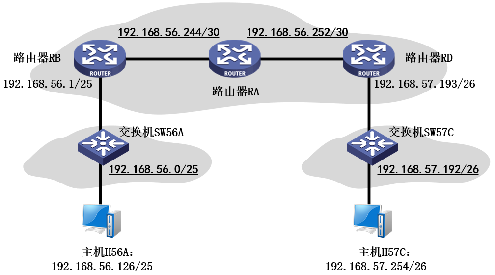

# 实验3：UDP协议探索与分析

## 【实验目的】

本实验的核心目的是帮助实验者熟悉UDP首部格式，掌握UDP首部各字段的具体含义与功能；熟悉Linux环境下ncat工具的使用方法，实现UDP客户端与服务端的数据通信。

此外，实验通过UDP协议报文抓取、分析及验证，帮助实验者理解UDP无连接、不可靠传输的核心特性，培养网络协议解析与网络基础故障排查能力，夯实UDP协议理论基础。

## 【实验内容】

基于openEuler操作系统，利用“网络拓扑助手”智能体辅助编写自动化脚本，完成实验环境搭建；通过ncat工具搭建UDP客户端与服务端通信链路；使用Wireshark抓取UDP数据包，筛选目标流量并解析UDP数据报首部字段，完整验证UDP协议传输机制与核心特性。

## 【实验拓扑】

本实验需要构建包含两台主机、两台交换机和三台路由器的网络拓扑，如图3.1所示。

主机H56A通过交换机SW56A与路由器RB相连，主机H57C通过交换机SW57C与路由器RD相连，主机H56A访问主机H57C的数据包，传输路径需依次经过路由器RB、RA、RD。



所有设备均配置IPv4协议栈，各节点固定IP规划如下：

(1) 主机H56A：192.168.56.126/25；主机H57C：192.168.57.254/26。

(2) 路由器RB连接SW56A接口：192.168.56.1/25；RB与RA的互连网络：192.168.56.244/30，两端接口的IP地址采用这个/30地址块中的可用地址。

(3) 路由器RD连接SW57C接口：192.168.57.193/26；RD与RA的互连网络：192.168.56.252/30，两端接口的IP地址采用这个/30地址块中的可用地址。

本实验拓扑主要关注端到端通信，连接路由器的两个网络的配置允许调整，完成设备IP配置与静态路由部署后，可实现两台主机的跨网络UDP通信。为规避网卡硬件运算对实验结果的干扰，实验中需关闭网卡offload功能，保证IP分片、UDP校验和等计算均由CPU完成。

## 【实验步骤】

本节以openEuler 24.03-LTS版本为例，详细讲解虚拟网络拓扑构建、UDP通信实例搭建、Wireshark抓包分析的完整流程，实验者需按序完成每一步，确保操作无误后再进行下一步。

**步骤1：环境检查**

(1) 确保已切换至root用户。若未切换，打开终端，执行su - root，输入管理员密码完成权限切换，保证后续网络配置、工具调用权限充足。

(2) 确保基础软件工具已安装。执行ip -V、wireshark --version等软件版本查询命令，确认iproute2、nmap、traceroute、Wireshark工具安装正常，可正常调用。

(3) 确保系统防火墙已关闭。执行systemctl status firewalld查看防火墙软件状态，若未关闭，执行systemctl stop firewalld关闭防火墙，避免虚拟路由器重组IP分片。

**步骤2：借助AI工具，搭建虚拟网络拓扑并验证**

(1) 借助“网络拓扑助手”，编写bash脚本。

在“网络拓扑助手”界面，输入提示词，描述本实验网络拓扑，由“网络拓扑助手”智能体创建脚本程序，并给出使用方法。

(2) 按照“网络拓扑助手”智能体给出的说明，执行脚本并创建实验网络拓扑。

```bash
# 修改脚本权限后，在脚本保存目录内，执行脚本程序
./create_topology.sh create
```

(3) 验证实验网络拓扑和配置并记录。

```bash
# 验证命名空间
ip netns list
# 在各命名空间内，分别验证网络接口（遍历上一步得到的命名空间名）
ip netns exec H56A ip link show
ip netns exec ……
# 在交换机命名空间内，验证网桥接口绑定（遍历上一步得到的网桥名）
ip netns exec SW56A bridge link show br_SW56A
ip netns exec ……
# 在各主机和路由器命名空间内，验证IPv4地址配置（遍历主机和路由器的命名空间名）
ip netns exec H56A ip addr
ip netns exec ……
# 测试主机H56A到主机H57C的可达性
ip netns exec H56A ping -c 4 192.168.57.254
# 测试主机H56A到主机H57C的转发路径
ip netns exec H56A traceroute 192.168.57.254
```

若验证结果不满足实验拓扑，可以将验证和测试结果粘贴给“网络拓扑助手”智能体，请求智能体修改网络拓扑脚本。重新创建网络拓扑，验证通过后，再进行后续步骤。

记录你创建的实验拓扑中，主机、交换机和路由器的命名空间（NS）名称、NS内VETH接口名称、VETH接口的IP地址（若有）、VETH接口的MAC地址、VETH接口的对端接口名称和所属NS名称。

(4) 验证网卡offload相关功能已关闭。

```bash
# 在指定命名空间中，查看指定网卡的offload功能状态（本实验要求遍历所有主机，验证所有VETH网卡的offload状态，ve_H56A应替换为你的网络接口名）
ip netns exec H56A ethtool -k ve_H56A | grep -E &quot;checksum|generic&quot;
ip netns exec ……
```

本实验要求接收校验和卸载（rx-checksumming）、发送校验和卸载（tx-checksumming）、GSO通用分段卸载（generic-segmentation-offload）的状态为off。

**步骤3：模拟两台主机终端环境**

(1) 新建第一个终端窗口，设置终端窗口标题为“H56A”，执行ip netns exec H56A bash命令，将当前终端模拟为H56A主机终端，后续H56A上的所有命令均在该主机模拟终端中执行。如需退出模拟终端环境，执行exit命令即可。

(2) 新建第二个终端窗口，设置终端窗口标题为“H57C”，执行ip netns exec H57C bash命令，将当前终端模拟为H57C主机终端，完成两台主机模拟终端环境搭建。

**步骤4：在H57C上，开启Wireshark抓包**

(1) 新建另一个终端窗口，执行ip netns exec H57C wireshark &命令，后台启动H57C主机环境下的Wireshark抓包工具。

(2) 在Wireshark界面中，选中H57C主机上的VETH虚拟网卡接口，启动抓包，用于抓取和观察后续UDP通信数据包。

**步骤5：搭建UDP客户端与服务端通信**

(1) 在主机H57C的模拟终端中，执行ncat -lvu 4499命令，开启UDP服务端程序，监听4499端口的UDP连接与数据传输。

(2) 在主机H56A的模拟终端中，执行ncat -u 192.168.57.254 4499命令，启动UDP客户端程序，指定UDP服务程序的IP地址和端口。

(3) 在主机H56A的模拟终端中，输入任意一行字符，然后回车确认，将输入的字符发送给服务器H57C。

(4) 在主机H57C的模拟终端中，输入任意一行字符，然后回车确认，将输入的字符发送给客户端H56A。

**步骤6：数据包分析和实验报告撰写**

停止Wireshark抓包，保存抓包文件，筛选UDP协议数据包，详细分析UDP用户数据报结构与首部各字段含义，整理实验截图与数据，完成实验报告撰写。
