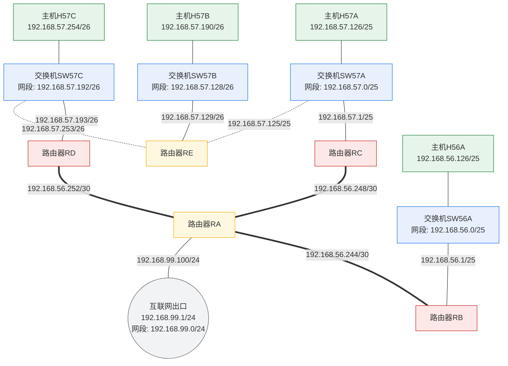

# 实验6：IP协议探索与IP分片分析

## 【实验目的】

本实验的核心目的是帮助实验者熟悉IP分组报文格式，掌握IP首部各字段的具体含义与功能；深入理解IP协议无连接、不可靠的核心特性，熟练掌握IP分片原理、分片规则及分片数据计算方法；深入理解IP分组转发算法。

此外，实验通过修改网络链路MTU、发送超限IP分组触发IP分片的实验场景，帮助实验者掌握Linux系统下链路MTU的修改方法，培养网络数据包解析、网络链路故障分析能力，夯实IP协议理论基础。

## 【实验内容】

基于openEuler操作系统，利用“网络拓扑助手”智能体辅助编写自动化脚本，完成实验环境搭建；通过修改路由器链路MTU制造分片条件，使用nping工具发送超限IP分组触发IP分片；利用Wireshark抓取路由器分片前后的IP分组，并解析IP分组首部字段；利用traceroute跟踪IP分组转发路径，追踪IP分组跨路由器传输、分片、转发的完整流程，验证IP分片核心原理与路由转发机制。

## 【实验拓扑】

**本实验在实验3－实验5的网络拓扑基础上进行拓展，共需要**构建包含四台主机、四台交换机和五台路由器的网络拓扑，如图6.1所示。

主机H56A通过交换机SW56A与路由器RB相连，主机H57A通过交换机SW57A与路由器RC和路由器RE相连，主机H57B通过交换机SW57B与路由器RE相连，主机H57C通过交换机SW57C与路由器RD和路由器RE相连，路由器RE通过交换机SW57A连接到路由器RC，路由器RE通过交换机SW57C连接到路由器RD，路由器RB、路由器RC、路由器RD均通过点对点链路连接到路由器RA，RA作为虚拟网络拓扑的出口路由器，通过点对点链路与主命名空间内的虚拟接口相连，该路径作为连接互联网的默认路径。

所有设备均配置IPv4协议栈，各节点固定IP规划如下：

(1) 主机H56A：192.168.56.126/25；主机H57A：192.168.57.126/25；主机H57B：192.168.57.190/26；主机H57C：192.168.57.254/26。

(2) 路由器RB连接SW56A的接口：192.168.56.1/25；RB与RA的互连网络：192.168.56.244/30，两端接口的IP地址采用该/30地址块中的可用地址。

(3) 路由器RD连接SW57C的接口：192.168.57.193/26；RD与RA的互连网络：192.168.56.252/30，两端接口的IP地址采用该/30地址块中的可用地址。

(4) 路由器RC连接SW57A的接口：192.168.57.1/25；RC与RA的互连网络：192.168.56.248/30，两端接口的IP地址采用该/30地址块中的可用地址。

(5) 路由器RE连接SW57A的接口：192.168.57.125/25；RE连接SW57B的接口：192.168.57.129/26；RE连接SW57C的接口：192.168.57.253/26。

(6) 路由器RA连接主命名空间的接口：192.168.99.100/24，主命名空间内的接口：192.168.99.1/24。

本实验拓扑中，完成设备IP配置后，需要为每台路由器配置静态路由和默认路由，以实现各主机间的跨网络TCP通信。为规避网卡硬件运算对实验结果的干扰，实验中需关闭网卡offload功能，保证IP分片、校验和计算等均由CPU完成。

*图（mermaid 绘制，原图 images/计算机网络实验指导书2026版实验6_img1.png）：*


## 【实验步骤】

本节以openEuler 24.03-LTS版本为例，详细讲解虚拟网络拓扑构建、MTU修改、IP分片触发、Wireshark抓包分析以及IP分组转发分析的完整流程，实验者需按序完成每一步，确保操作无误后再进行下一步。

**步骤1：环境检查**

(1) 确保已切换至root用户。若未切换，打开终端，执行su - root，输入管理员密码完成权限切换，保证后续网络配置、工具调用权限充足。

(2) 确保基础软件工具已安装。执行ip -V、wireshark --version等软件版本查询命令，确认iproute2、nmap、traceroute、Wireshark工具安装正常，可正常调用。

(3) 确保系统防火墙已关闭。执行systemctl status firewalld查看防火墙软件状态，若未关闭，执行systemctl stop firewalld关闭防火墙，避免虚拟路由器重组IP分片。

**步骤2：借助AI工具，搭建虚拟网络拓扑并验证**

(1) 借助“网络拓扑助手”，编写bash脚本。

在“网络拓扑助手”界面，输入提示词，描述本实验网络拓扑、静态路由和默认路由配置要求，由“网络拓扑助手”智能体创建脚本程序，并给出使用方法。

(2) 按照“网络拓扑助手”智能体给出的说明，执行脚本并创建实验网络拓扑。

```bash
# 修改脚本权限后，在脚本保存目录内，执行脚本程序
./create_topology.sh create
```

(3) 验证实验网络拓扑和配置并记录。

```bash
# 验证命名空间
ip netns list
# 在各命名空间内，分别验证网络接口（遍历上一步得到的命名空间名）
ip netns exec H56A ip link show
ip netns exec ……
# 在交换机命名空间内，验证网桥接口绑定（遍历上一步得到的网桥名）
ip netns exec SW56A bridge link show br_SW56A
ip netns exec ……
# 在各主机和路由器命名空间内，验证IPv4地址配置（遍历主机和路由器的命名空间名）
ip netns exec H56A ip addr
ip netns exec ……
# 测试主机H56A到主机H57A、H57B、H57C的可达性
ip netns exec H56A ping -c 2 192.168.57.126
ip netns exec H56A ping -c 2 192.168.57.190
ip netns exec H56A ping -c 2 192.168.57.254
```

若验证结果不满足实验拓扑，可以将验证和测试结果粘贴给“网络拓扑助手”智能体，请求智能体修改网络拓扑脚本。重新创建网络拓扑，验证通过后，再进行后续步骤。

记录你创建的实验拓扑中，主机、交换机和路由器的命名空间（NS）名称、NS内VETH接口名称、VETH接口的IP地址（若有）、VETH接口的MAC地址、VETH接口的对端接口名称和所属NS名称。

注意：每次重新执行脚本，创建的VETH接口MAC地址有可能不同。

(4) 验证网卡offload相关功能已关闭。

```bash
# 在指定命名空间中，查看指定网卡的offload功能状态（本实验要求遍历所有主机，验证所有VETH网卡的offload状态，ve_H56A应替换为你的网络接口名）
ip netns exec H56A ethtool -k ve_H56A | grep -E &quot;checksum|generic&quot;
ip netns exec ……
```

本实验要求接收校验和卸载（rx-checksumming）、发送校验和卸载（tx-checksumming）、GSO通用分段卸载（generic-segmentation-offload）的状态为off。

**步骤3：修改核心链路MTU，制造IP分片条件**

**本实验通过缩小RB与RA之间链路的MTU值，使超过MTU值的IP分组触发分片机制。**

```bash
# 修改RA侧接口MTU为1000字节
ip netns exec RA ip link set dev ve_RA_RB mtu 1000
# 修改RB侧接口MTU为1000字节
ip netns exec RB ip link set dev ve_RB_RA mtu 1000
```

**步骤4：模拟主机H56A和主机H57C的终端环境**

(1) 新建第一个终端窗口，设置终端窗口标题为“H56A”，执行ip netns exec H56A bash命令，将当前终端模拟为H56A主机终端，后续H56A上的所有命令均在该主机模拟终端中执行。如需退出模拟终端环境，执行exit命令即可。

(2) 新建第二个终端窗口，设置终端窗口标题为“H57C”，执行ip netns exec H57C bash命令，将当前终端模拟为H57C主机终端，完成两台主机模拟终端环境搭建。

**步骤5：在路由器RB上，开启Wireshark抓包，监控两个接口**

**为完整观测IP分组进入路由器、分片、出路由器的全过程，需在路由器RB的两个关键接口同时开启抓包。**

(1) 新建另一个终端窗口，执行ip netns exec RB wireshark &命令，后台启动路由器RB下的Wireshark抓包工具。

(2) 在Wireshark界面中，选中RB上与主机H56A连接的网卡接口，启动抓包，**用于观测未分片的原始数据包进入路由器的状态**。

(3) 在这个终端窗口内，再次执行ip netns exec RB wireshark &命令，后台启动路由器RB下的Wireshark抓包工具。

(4) 在Wireshark界面中，选中RB上与RA连接的网卡接口，启动抓包，**用于观测经过路由器分片后的数据包转发状态**。

**步骤6：构建UDP通信，触发IP分片**

**利用ncat和nping工具构造UDP通信，封装超过MTU的数据，触发IP分片。**

(1) 在主机H57C的模拟终端中，执行ncat -lvu 4499命令，开启UDP服务端程序，监听4499端口。

(2) 在主机H56A的模拟终端中，执行nping --udp -p4499 -g40321 -c1 --data-length 1400 192.168.57.254**命令，利用nping工具封装包含1400字节数据的UDP报文，并指定客户端端口40321、服务端端口4499，发往主机H57C。**

**命令执行后，客户端发送的UDP报文，被封装到IP分组内部，经路由器RB转发时，因链路MTU限制，将被自动分片处理。**

**步骤7：停止抓包，进行IP分片的分析**

**在两个Wireshark窗口中停止抓包，保存抓包结果文件，过滤IP分组并分析本次通信，理解IP分组格式，分析IP首部各字段含义。分析IP分组在路由器RB上的分片过程。**

**步骤8：跟踪路由，分析路由表，理解IP分组转发算法**

**从主机H56A分别发起到主机H57A、H57B和H57C的路由跟踪，分析三次通信中途经的路由器的路由表，理解IP分组转发算法。**

(1) 在主机H56A的模拟终端中，执行traceroute -n 192.168.57.126**命令，发起到主机H57A的路由跟踪，根据路由跟踪结果，查阅自己的实验网络拓扑结构，得到途经的路由器清单。**

(2) 新建一个终端窗口，根据上一步记录的途经路由器清单，依次执行ip netns exec 路由器ns名 ip route命令，依次打印途经路由器的路由表。分析路由表和IP分组转发路径，理解IP分组转发算法。

(3) 在主机H56A的模拟终端中，执行traceroute -n 192.168.57.190**命令，发起到主机H57B的路由跟踪，根据路由跟踪结果，查阅自己的实验网络拓扑结构，得到途经的路由器清单。**

(4) 新建一个终端窗口，根据上一步记录的途经路由器清单，依次执行ip netns exec *路由器ns名* routel命令，依次打印途经路由器的路由表。分析路由表和IP分组转发路径，理解IP分组转发算法。

(5) 在主机H56A的模拟终端中，执行traceroute -n 192.168.57.254**命令，发起到主机H57C的路由跟踪，根据路由跟踪结果，查阅自己的实验网络拓扑结构，得到途经的路由器清单。**

(6) 新建一个终端窗口，根据上一步记录的途经路由器清单，依次执行ip netns exec 路由器ns名 ip route命令，依次打印途经路由器的路由表。分析路由表和IP分组转发路径，理解IP分组转发算法。

**步骤9：实验结果分析和实验报告撰写**

详细分析步骤7中的抓包结果文件，解析IP首部中各字段的值，对比分片前后IP首部中各字段值的变化，理解IP分片机制；详细分析步骤8中IP分组转发路径和各路由器的路由表，理解IP分组转发算法；整理实验截图与实验数据，完成实验报告撰写。
