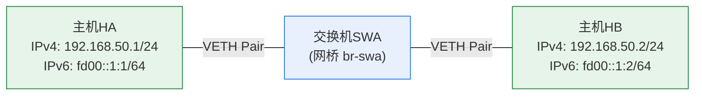

# 实验1 图1.1：实验网络拓扑图

> 原图：`计算机网络实验指导书2026版实验1_img1.png`（882×390）
> 双重确认：OCR（tesseract chi_sim+eng）与视觉识别结果一致

## OCR 识别文本

```text
交换机SWA
主机HA:  IPv4地址: 192.168.50.1/24   IPv6地址: fd00::1:1/64
主机HB:  IPv4地址: 192.168.50.2/24   IPv6地址: fd00::1:2/64
```

## Mermaid 网络拓扑图



## 说明

两台主机 HA、HB 通过交换机 SWA 相连，构成一个局域网（192.168.50.0/24），
双协议栈：IPv4 子网 `192.168.50.0/24`，IPv6 子网 `fd00::1:/64`（ULA 唯一本地地址）。
