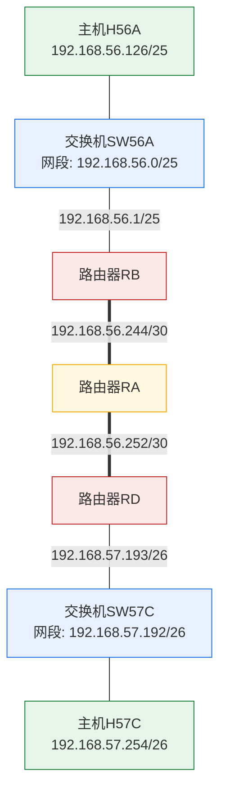

# 实验4 图4.1：实验网络拓扑图

> 原图：`计算机网络实验指导书2026版实验4_img1.png`（83399 字节）
> 双重确认：OCR（tesseract chi_sim+eng）与视觉识别结果一致
> 注：实验3、实验4、实验5 的配图在源文档中为同一张图片（文件内容完全相同），
>      本文件与 `计算机网络实验指导书2026版实验3_img1.md` 内容一致

## OCR 识别文本

```text
192.168.56.244/30    192.168.56.252/30
路由器RB              路由器RD
192.168.56.1/25      192.168.57.193/26
路由器RA
交换机SW56A          交换机SW57C
192.168.56.0/25      192.168.57.192/26
主机H56A: 192.168.56.126/25
主机H57C: 192.168.57.254/26
```

## Mermaid 网络拓扑图



## 说明

该拓扑用于 TCP 协议探索与连接管理分析实验（实验4）：
两台主机 H56A、H57C 分处 `192.168.56.0/25` 与 `192.168.57.192/26` 两个局域网，
经路由器 RB—RA—RD 三跳路由互通，用于抓取并分析 TCP 三次握手、
数据传输与四次挥手全过程。
