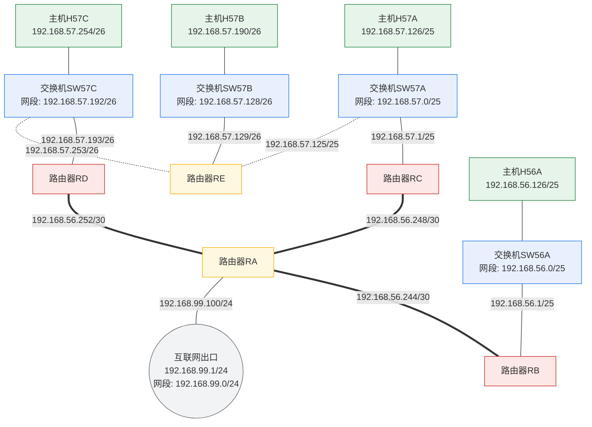

# 实验6 图6.1：实验网络拓扑图

> 原图：`计算机网络实验指导书2026版实验6_img1.png`（247957 字节，1071×1076）
> 双重确认：OCR（tesseract chi_sim+eng）与视觉识别结果一致

## OCR 识别文本

```text
主机H57B: 192.168.57.190/26
主机H57A: 192.168.57.126/25        主机H57C: 192.168.57.254/26
交换机SW57B  192.168.57.128/26
192.168.57.129/26
192.168.57.125/25        192.168.57.253/26
路由器RE
交换机SW57A  192.168.57.0/25      交换机SW57C  192.168.57.192/26
192.168.57.1/25                  192.168.57.193/26
路由器RC        192.168.56.248/30   192.168.56.252/30   路由器RD
路由器RA
192.168.99.100/24
192.168.99.0/24    192.168.56.244/30
互联网出口: 192.168.99.1/24
192.168.56.1/25   交换机SW56A  192.168.56.0/25
路由器RB
主机H56A: 192.168.56.126/25
```

## Mermaid 网络拓扑图



## 说明

实验6（IP 协议探索与 IP 分片分析）的多路由器综合拓扑，共 5 台路由器、
4 台交换机、4 台主机和 1 个互联网出口：

| 链路 | 网段/接口地址 |
|---|---|
| H57A ↔ SW57A | 局域网 `192.168.57.0/25`，H57A `192.168.57.126/25` |
| SW57A ↔ RC | RC 接口 `192.168.57.1/25` |
| SW57A ↔ RE | RE 接口 `192.168.57.125/25`（与 SW57A 同网段） |
| H57B ↔ SW57B | 局域网 `192.168.57.128/26`，H57B `192.168.57.190/26` |
| SW57B ↔ RE | RE 接口 `192.168.57.129/26` |
| H57C ↔ SW57C | 局域网 `192.168.57.192/26`，H57C `192.168.57.254/26` |
| SW57C ↔ RD | RD 接口 `192.168.57.193/26` |
| SW57C ↔ RE | RE 接口 `192.168.57.253/26`（与 SW57C 同网段） |
| RC ↔ RA | 点对点链路 `192.168.56.248/30` |
| RD ↔ RA | 点对点链路 `192.168.56.252/30` |
| RA ↔ RB | 点对点链路 `192.168.56.244/30` |
| RA ↔ 互联网出口 | RA 接口 `192.168.99.100/24`，出口 `192.168.99.1/24` |
| RB ↔ SW56A | RB 接口 `192.168.56.1/25`，局域网 `192.168.56.0/25`，H56A `192.168.56.126/25` |

路由器 RA 为核心汇接节点（上联互联网出口，下联 RB/RC/RD），
RE 为 57 网段汇聚路由器（同时接入 SW57A/SW57B/SW57C 三个局域网）。
该拓扑用于 IP 协议探索、MTU 修改与 IP 分片触发分析。
