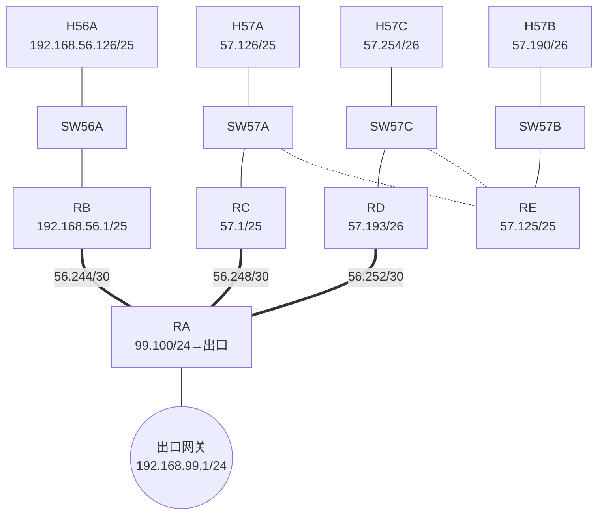

# 实验6 脚本说明

对应指导书《实验6：IP协议探索与IP分片分析》各步骤的一键化脚本。
**大拓扑**：4 主机 + 4 交换机 + 5 路由器 + 1 互联网出口（共 14 个命名空间），核心内容：修改 MTU 触发 IP 分片 + traceroute 路由表分析。

## 拓扑与 IP 规划（指导书固定地址）



## 脚本清单与执行顺序

| 顺序 | 脚本 | 对应步骤 | 作用 |
|---|---|---|---|
| 1 | `step1_check_env.sh` | 步骤1 环境检查 | 工具检查（重点 **nping**）、关闭 firewalld |
| 2 | **`create_topology.sh`** | **步骤2（要求实现的脚本）** | 一键 create/verify/destroy：14 命名空间 + 4 网桥 + 14 对 VETH + 全网静态路由 |
| 3 | `step3_set_mtu.sh` | 步骤3 | RB-RA 链路两侧 MTU 改为 1000（可调）+ 回归测试 |
| 4 | `step6_ip_fragment.sh` | 步骤5/6 | RB 双接口 tshark 抓包 + `nping` 发 1400B UDP 触发分片 |
| 5 | `step7_analyze_fragment.sh` | 步骤7 | 分片前后 IP 首部字段对比（id/MF/片偏移/TTL） |
| 6 | `step8_traceroute_routes.sh` | 步骤8 | 三条 traceroute + 自动打印途经路由器路由表（ip route + routel） |

## 快速开始

```bash
cd shell/exp6
chmod +x *.sh

sudo ./step1_check_env.sh
sudo ./create_topology.sh create
sudo ./create_topology.sh verify          # 三次 ping 全通
sudo ./step3_set_mtu.sh 1000
sudo ./step6_ip_fragment.sh               # -> /tmp/exp6_rb_in.pcap + exp6_rb_out.pcap
./step7_analyze_fragment.sh
sudo ./step8_traceroute_routes.sh
sudo ./create_topology.sh destroy
```

## 预期实验现象（汇总）

1. **步骤2 verify**：14 个命名空间；H56A→H57A/H57B/H57C 三次 ping 全通（路径分别为 RB-RA-RC、RB-RA-RC-RE、RB-RA-RD）。
2. **步骤3**：两侧接口 `mtu 1000`；小包 ping 不受影响。
3. **步骤6**：nping 发送 1 个 1400B 载荷 UDP 报文（IP 总长 1428 > MTU 1000）：
   - **入接口 pcap**：1 个未分片原始分组（len=1428, MF=0, offset=0）
   - **出接口 pcap**：2 个分片——片1 len=996（IP头20+数据976，分片数据按 8 字节向下取整）/MF=1/offset=0，片2 len=452/MF=0/offset=976（tshark 显示字节值；IP 首部片偏移字段本身以 8 字节为单位，=122），两片 `ip.id` 相同、TTL 均减 1、仅片1 带 UDP 头
4. **步骤8**：三条 traceroute 逐跳输出途经路由器，与规划路径一致；各路由器路由表体现**最长前缀匹配**的逐跳转发算法。

## 注意事项

- `nping`/`ncat` 属 `nmap` 包；`routel` 属 iproute2 包。
- 分片数据按 8 字节对齐：片1 携带 976B IP 载荷（976/8=122 个片偏移单位），片2 携带剩余 432B IP 载荷；tshark 的 `-e ip.frag_offset` 输出**字节**偏移（片2 打印 976，不是 122）。
- traceroute 某跳显示 `* * *` 多为路由器对探测包限速回复，不影响后续跳，属正常。
- GW 命名空间仅用于模拟互联网出口（192.168.99.1），使 RA 的默认路由下一跳可达。**注意**：指导书原文是在主命名空间创建虚拟接口 `192.168.99.1/24` 作为点对点链路对端，本脚本改用独立 GW 命名空间实现等价方案（可产生同样的转发行为），实验报告中引用指导书原文时请说明这一实现差异。
- 步骤2(3)(4) 的拓扑记录与 offload 检查方法同实验3（`shell/exp3/step2_verify_offload.sh` 思路，接口名按本拓扑替换）。
